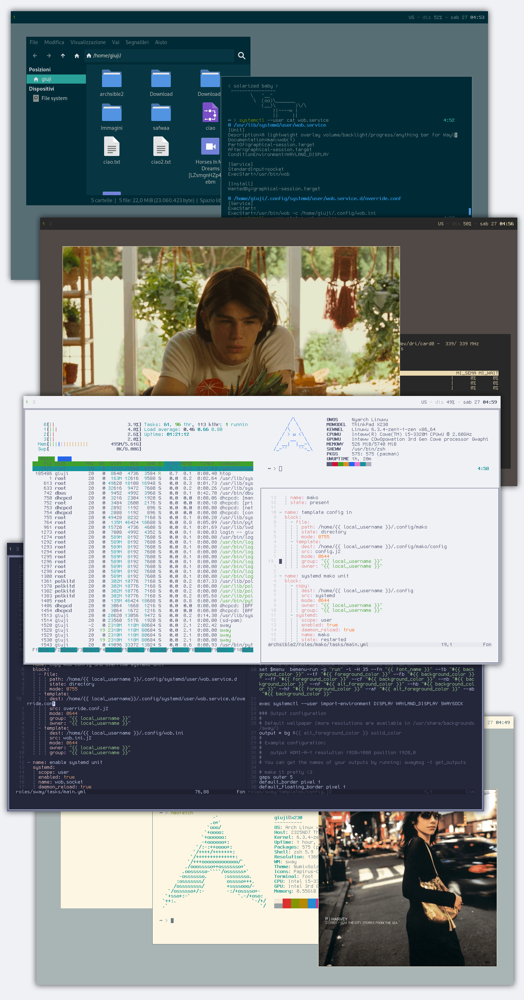

# archsible2
automated void linux setup through ansible  
**intended for local connection only**  



files under `group_vars/` are the various colorschemes available, to choose one edit the inventory file `hosts` like this: 
```
[your_desired_colorscheme]
your_hostname ansible_connection=local
``` 
## usage 
**the playbook is intended for my personal use only**

clone the repo  
`git clone https://github.com/giuji/archsible2 && cd archsible2`  
install requirements  
`ansible-galaxy collection install -r requirements.yml`  
create an entry for you host under `host_vars/` and populate it with required variables, check already available entries for examples  
`*your_editor* host_vars/*your_hostname*.yml`  
edit the [inventory file](https://docs.ansible.com/ansible/latest/inventory_guide/intro_inventory.html) to add your host 
`*your text editor* hosts`  
run the playbook  
`ansible-playbook -i hosts -l *your hostname* -K -v playbook.yml`  

---

[todo](TODO.md)
